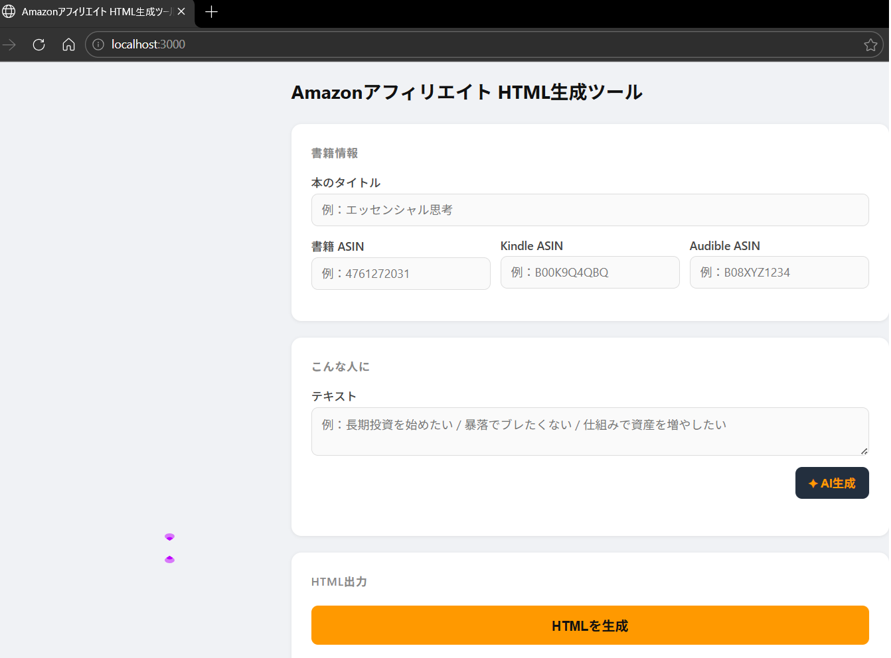
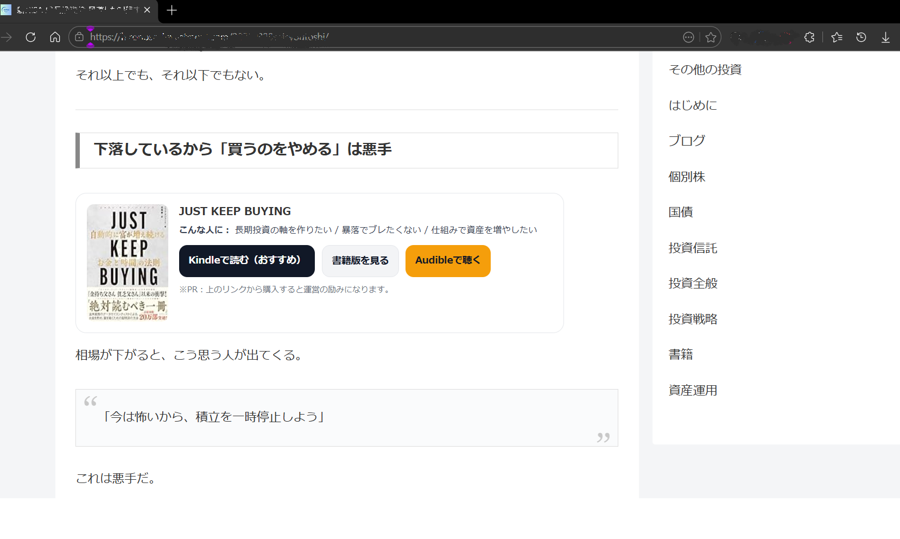

# 📚 Amazon アフィリエイト HTML生成ツール

AmazonのASINを入力するだけで、アフィリエイトリンク付きのHTMLカードを自動生成するローカルWebツールです。
Claude AIが「こんな人に」のテキストも自動で考えてくれます。

## 🖼️ 完成イメージ

**ツール画面**

**ブログへの表示例**

## ✅ 必要なもの

- Node.js（インストール済みであること）
- Anthropic APIキー（AI生成機能を使う場合）
- Amazon アソシエイトID

## 🚀 起動方法

1. node server.js を実行
2. ブラウザで http://localhost:3000 を開く

## 📝 ライセンス

MIT License。Claude Codeを使って作成しました。自由に使用・改変・再配布してください。